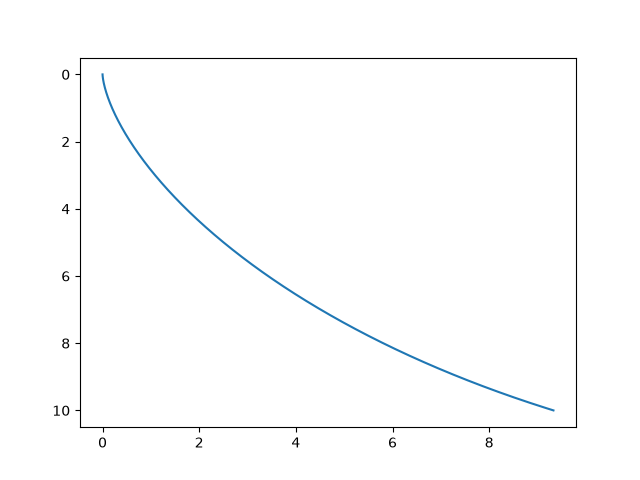
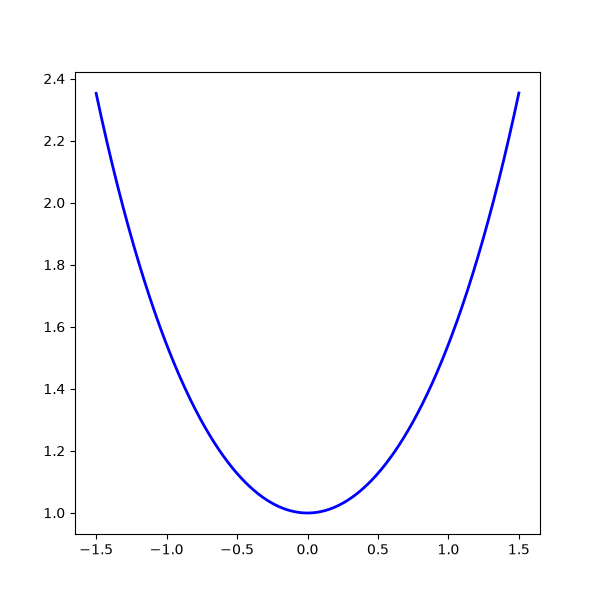

## 最速降下問題
### 問題
この問題は古典力学において伝統的な問題である．
任意の二点間を結ぶすべての曲線のうち，曲線上に軌道を束縛された物体に対して重力のみが作用する仮定の元，物体が速度0でポテンシャルが高い方の点を出発してからもう一方の点に達するまでの所要時間が最も短いような曲線を求めよ．

### 指針
まずこの所要時間は曲線を$q$としたとき$T[q]$と汎関数で表現できる．まずこの$T[q]$がどのような式なのかを求め，それを変分法によって最小値を求めることが大まかな流れである．

### $T[q]$の具体的な中身
まず$T$は微小時間$dt$の積分だと考えれる．
$$
T[q] = \int_0^T dt[q]
$$
ではこの$dt[q]$を求める．
座標系は鉛直下向きを$x$軸，水平方向に$q(x)$軸をとることを考える．
微小時間移動なので，微小区間を移動していると考えられる．そこで$(x,q(x))$から$(x + dx , q(x + dx))$までにかかった時間を$dt$と考える．
これは微小区間なので二点間は直線で結べる．より正確には
$$
 q(x + dx) = q(x) + \frac{\partial q}{\partial x} dx + O((dx)^2)
$$
と記述できる．（O記法についても書かないと）
ここで$(dx)^2$は無視する.
エネルギー保存則より
$$
\frac{1}{2} m v^2 = mgx
$$
が成立するので
$$
v = \sqrt{2gx}
$$
また進む距離は三平方の定理より
$$
ds = dx\sqrt{1 + \left(\frac{\partial q}{\partial x}\right)^2}
$$
となる．微小区間と微小時間において
$$
dt = \frac{ds}{v}
$$
であるので
$$
dt = \sqrt{\frac{1 + \left(\frac{\partial q}{\partial x}\right)^2}{2gx}}dx
$$

である．よって，これを$L(x,q')$とおくと
$$
T[q] = \int_a^b dx L(x,q')
$$
となることが分かる．
これを前回求めた変分の式

$$
\delta J = \int_a^b \frac{\partial F}{\partial x} \delta x -\frac{d}{dt} \frac{\partial F}{\partial \dot x} \delta x dt
$$
を用いてやると

$$
\delta T = \int_a^b -\frac{d}{dx} \frac{\partial L}{\partial q' } \delta q dx
$$

である．
$$\frac{\partial L}{\partial q' }  = \frac{1}{\sqrt{2g}} \frac{q'}{\sqrt{x(1+q'^2)}}$$

となることが計算によって確かめられる．

$\delta T = 0$となるような$q$を探しているので
$$
-\frac{d}{dx} \frac{\partial L }{\partial q'} = 0
$$
すなわち，
 $$
 \frac{\partial L}{\partial q'} = C
$$

が成立する．

結局
$$
q' = C\sqrt{x(1 + q'^2)}
$$
という常微分方程式を満たすような$q$が解であることが分かる．
ここから先は専門外なので(ここでは微分方程式を導出することが目的である)ので，解析的には解かないが，数値的に解いていこうと思う．
式変形を色々繰り返していくと
$$
\frac{dq}{dx} = \sqrt{\frac{x}{D -x}}
$$
を解く必要がある．オイラー法でこの曲線を表示すると

となる．(一応解析解はサイクロイドなので，それにほぼ一致するような曲線になっていることが分かる．)

## Newtonの運動方程式
Newtonの運動方程式も作用の変分から導出可能である．（歴史的にはNewtonの方程式に合わせるために作用を次のように定義したが，どちらから出発しても問題はないだろう．）
まず力学現象を観察すると次のような普遍的な法則があることが分かるだろう．
1. どの時刻でも同じ原因なら同じ力学現象が起こる
2. どの場所でも同じ原因なら同じ力学現象が起こる
3. どの向きでも同じ原因なら同じ力学現象が起こる
4. ある粒子の状態は位置と速度を与えれば完全に指定される
5. お互いに等速直線運動をしているどの観測者から見ても、同じ原因なら同じ力学現象が起こる(相対性原理)

（余談だが，量子力学では4が成立せず，相対性理論では5が成立しない）

さて，物体が運動しているとき物体はある意味の無駄を嫌い，なにか特定の物理量をなるべく少なくしようとするような経路を選択しているように思われる．物体が最小化しようとしているなにかを作用$S$と定義する．
すなわち物体は$\delta S =0$を満たす経路を移動すると考えられる．

ここで$S$は経路を引数とした汎関数である．この$L$をラグラジアンと呼ぶ．
$$
S[q] = \int_{t_1}^{t_2} dt L
$$
まずラグラジアンはある時刻において粒子の状態を決定づけるものなので法則4より，
$$
L = L(q,\dot q,t)
$$
の関数であることが分かる．
まず，もっと単純な他から一切力を受けない粒子を考える．
まず法則１により，環境の直接的な時間変化は存在しない($q,\dot q$が含む)
なので
$$
L = L(q,\dot q)
$$
が成立する．

法則２によりどの場所にいても自由粒子の物理的性質は不変である．なので$L$は$q$を明示的に依存しない．したがって
$$
L = L(\dot q)
$$
となる．

法則３により，空間のすべての方向は等価であるため，ラグラジアンは回転に対して不変でなければならない．これは単に速度ベクトルではなく，速度ベクトルの大きさ，すなわち速さでラグラジアンが構成されることを意味している．
すなわち
$$
L = L(\dot q^T \dot q)
$$
が成立する．

さて法則5を使いたいので，お互いに等速直線運動をしている別の観測者からこの粒子を見る．この観測者から見た粒子の速度を$\dot q' = q' + \epsilon$とする（微小な差である）
物体が選択する経路を決定するのは作用の変分であった，したがって２つの観測者における作用$S$ と$S'$が結果として同じ経路を選択する必要がある．すなわちこれは
$$
\delta(S' - S) = 0
$$
を満たすことである．
$$
S' - S = \int_{t_1}^{t_2} L' - L dt 
$$
であるので，もしラグラジアンが
$$
L' - L = \frac{d}{dt} f(q,t)
$$
という形をしていれば
作用の差は定数となる．なのでその変分は0になる．

さて左辺をテイラー展開し，二次以降を無視すると
$$
L' - L = \frac{\partial L}{\partial q'^2}(2\dot q \epsilon) = \frac{d}{dt} f(q,t)
$$
となる．
ここで，この等式を満たされるためには速度に寄る偏微分が定数ではないといけない．この定数を$\frac{1}{2} m$とする．これは質量と呼ばれるパラメータである．
これによって
$$
\frac{\partial L}{\partial q'^2} = \frac{1}{2}m
$$

これを積分することで，自由粒子のラグラジアンが決定される
$$
L = \frac{1}{2}m \dot q^2
$$

これは物体の持つ運動エネルギーと呼ばれる．

次に重力から受ける他から力を受ける一般的な粒子について考える．
他から受ける影響が粒子の位置のみに依存し，速度には依存しないと仮定する（保存力）．空間の一様性を保ちつつこの効果をラグラジアンに取り込む最も単純な方法は、自由粒子のラグラジアンから．位置のみに依存する関数である位置エネルギーを差し引くことである.（マイナスになるのは，時間対称性から導出される）

$$
L = \frac{1}{2} m \dot q^2 - V(q)
$$

これをオイラーラグランジュ方程式に代入すると

$$
m \ddot q = -\frac{\partial V}{\partial q}
$$

となり力を
$$
F  := -\frac{\partial V}{\partial q}
$$

と定義するとこれはNewtonの運動方程式$ma = F$である．
このようにNewtonの運動方程式も作用の変分により導出される．

## 懸垂線問題 

紐の両端を持ってぶら下げたときにできる曲線を求める．まず紐は持っている位置エネルギーを最小化するような曲線であると考えられるので，紐の長さ$b$,重力加速度$g$,線密度$\rho$ ,長さ$b$,線素$ds$としたとき，横軸を$x, [0,a]$,縦軸を$q(x)$としたとき，線素がもつ位置エネルギーは
$$
dV = \rho \times ds \times g \times q(x)
$$
である．これを積分すれば作用は求まる
$$
V = \rho g\int_0^b q(x)ds = \rho g \int_0^a q(x) \sqrt{1 + \left(\frac{\partial q}{\partial x}\right )^2} dx
$$
ただし制約条件として
$$

b = \int_0^a{ \sqrt{1 + \left(\frac{\partial q}{\partial x}\right )^2} }dx

$$

が入る．これはラグランジュ未定乗数法で解く，未定乗数を$\lambda$とすると
L(q, q') = \rho g (q - \lambda') \sqrt{1 + q'^2}
$$
$$

となる．オイラーラグランジュ方程式に代入し整理すると

$$
(q - \lambda') q'' = 1 + q'^2
$$
が方程式となる.
これの解は次のようになる．

## まとめ

今回は古典力学における有名な問題で変分法で解けるものを紹介した．
次回は少し発展的な内容をしようと考えている．
