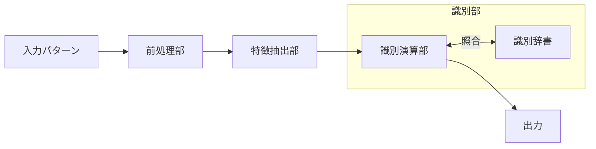

##  はじめに
これはテスト勉強用に残すやつです．時間があまりないので，細かい式変形などは飛ばします（疑問に思ったところはかきますが ）．教科書は「わかりやすいパターン認識」を使います．（結構古典的名著って感じがする．コードを書いてほしい．）
## パターン認識とはなにか

パターン認識とは，観測されたパターンを予め定められた複数の概念のうちの一つに対応させる処理のことである．
例をあげるなら，アルファベットの認識であれば，画像データから26個のクラスのいずれかに対応させる処理ということになる．

機械でパターン認識系を構成するとき

という流れの形を取ることが多い．
前処理と特徴抽出は理解できるので置いておいて，
識別演算部と識別辞書について考える，識別演算部はどのクラスに一番近いかを計算するところである．それはスコアでもいいし，確率的でも良い．
その識別演算部にデータを渡す（相対的な距離を測るためのもの）ものが辞書部である．

## 特徴ベクトルと特徴空間

識別部にデータを通すためにはまず特徴を数値化しないといけない．例えば文字認識の場合は，文字線の傾き，幅，曲率などが用いられたりする．
これらを組にしたベクトルを識別部に入れる．いま$d$個の特徴を用いることにすると，パターンは次の式のような$d$次元ベクトル$x$として表される．

$$
x = (x_1, ... x_d)^t
$$

上のベクトルを特徴ベクトル，特徴ベクトルによってはられる空間を特徴空間と呼ぶ．
$c$個のクラスが与えられていて．各クラスを$\omega_1 ,... , \omega_c$で表す．
同じクラスに属していれば，特徴が近いということなので，それは特徴空間において距離の近いところにいると解釈できる．このベクトルで構成される塊をクラスタと呼ぶ．

例として手書き文字数字認識に適応してみる．
$5 \times 5$のメッシュを特徴とする．
特徴ベクトルの要素は黒のとき$1$,白のとき$0$とする．
パターンの数は合計して$2^{25}$ある.最も単純な識別系の構成法はすべてのパターンを，クラス名とともに識別辞書として格納することである．
このパターンは１，このパターンは７みたいな感じで．
ただし，この全パターンのうちには，数字として意味をなさないものも多数含まれている．このようなパターンに対しては11番目のパターンとして，リジェクトを割り当てれば良い．

しかしこの手法は記憶容量，識別時間の点で非現実的である．
策として，すべての可能性を網羅する代わりに代表的なパターンのみを記憶する方法が考えられる．この代表的なパターンのことをプロトタイプと呼ぶ．
代表的とかいてあるので，あたかもクラスにつき1つだけのように見えるが，プロトタイプはクラスにつき複数定義できるし，それが一般的である．
入力パターンは特徴空間上でこれらのプロトタイプと比較され，最も距離が近いプロトタイプ，すなわち最近傍の属するクラスを識別結果として出力する．この手法のことをNN法(Nearest Neighbor rule)という．

### NN法の定式化
 今$n$個のパターンがその所属するクラスとともに$(x_1,\theta_1), ..., (x_n , \theta_n)$で与えられている．ただし$\{ \omega_1 ,..., \omega_c \}$．一般に$c \ll n$である．(数字識別なら$c=10$だが，$n = 100000$など大量のパターンを用意する．)
 ここで$D(x,x_p)$を$x$と$x_p$の距離とすると
 $$
\theta_p = \arg \min_{p = 1,2,...n} {D(x,x_p)} 
$$
$\theta_p$が$x$のクラスとなる．

これを拡張したもので，距離をすべて測って，上位$k$個のプロトタイプを取り，多数決した結果を識別結果として出力する方法がある．これを$k$-NN法と呼ぶ．上のNN法は$1$-NN法である．

## 特徴空間の分割

それでは機械にパターン認識機能を持たせるためにプロトタイプをどのようにして設定すればよいのか．もっとも単純な方法は収集した全パターンをプロトタイプとすることである．これは全数記憶方式と呼ばれる．上で紹介した$n = 100000$すべてのデータの距離を測るNN法は全数記憶方式である．だがこれは少し効率が悪い．もう少し効率のよい手法として，少数のパターンをプロトタイプとして設定する方法が考えられる．
例えば特徴空間の重心をプロトタイプとして選べば，効率よく分離できるのではないか．クラス間を分断する境界を決定境界と呼ぶ．
決定境界は$d$次元特徴空間の際は$d-1$次元部分空間である．この部分空間を超平面とよぶことが多い．

## おわりに
全数記憶方式ってなんだろうなって初めて勉強したとき考えました．けっこう省略している部分が多いので教科書を読んだほうが良いと思います．

