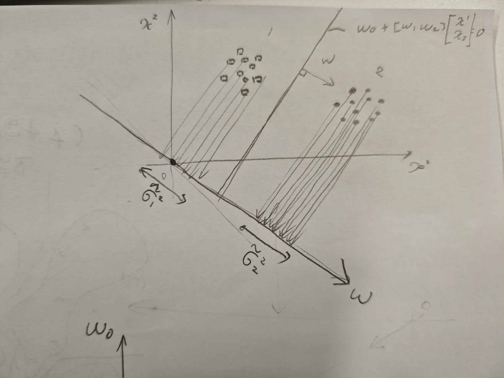

## ベイズ決定則
$P(\omega_i | x)$は未知パターン$x$が入力されたとき，その所属するクラスが$\omega_i$である確からさを示している．したがって$x$を識別する際に事後確率$P(\omega_i | x)$が最大となる$\omega_i$を識別結果として出力するのが最も自然である．
$$
\max_{i = 1 ,...,c} \{ P(\omega_i | x) \} =P(\omega_k | x) , x\in \omega_k
$$
が識別方となる．このような識別法をベイズ決定則と呼ぶ．
NN法に当てはめて考えると$D$を$P(\omega_i | x)$に変えたと解釈できる
ベイズの定理を用いると
$$
g_i(x) = p(x | \omega_i) p(\omega_i)
$$
となる，あるいは対数をとって
$$
g_i(x) = \log p(x | \omega_i) + \log p(\omega_i)
$$
としてもよい．
## ベイズ決定則の具体例：多次元正規分布
ベイズ決定則の具体例として，尤度が多次元正規分布の場合を考える．

$$
p(x | \omega_i) = \frac{1}{(2\pi)^{\frac d 2} |\Sigma_i|^{\frac 1 2}} \exp{\left( -\frac 1 2 (x - m_i)^T\Sigma_i^{-1}(x - m_i) \right)}
$$
これを識別関数の式に代入し,さらに比較に関係のない項を省くと

$$
g_i(x) = (x - m_i)^T \Sigma_i^{-1}(x - m_i) - \frac 12\log|\Sigma_i|+ p(w_i)  
$$
となり，識別関数は$x$についての二次関数になることが分かる．
$$
D^2_M =  (x - m_i)^T \Sigma_i^{-1}(x - m_i)
$$

とすると$D_M$はマハラノビス汎距離と呼ばれる．

次に全クラスで分散共分散行列が等しい場合を考える．
$$
\Sigma_i = \Sigma_0
$$
とおき，比較に関係のない項を省略すると
$$
g_i(x) = x^T\Sigma_0^{-1} m_i - \frac 1 2 m_i^T \Sigma_0^{-1}m_i + \log p(\omega_i)
$$
となる．これは明らかに線形識別関数である．

ここで，$\Sigma_0$を特徴量同士には相関がなく，分散が等しいとする．さらに，事前確率が各クラスで等しいとする($p(w_i) = \frac 1 c$).
そうするならば
$$
g_i = m_i^T x - \frac 1 2 |m_i|^2
$$
としてよい．これはNN法で用いた最小距離識別法と一致する．

教科書にある最尤推定法はよく知られているので省略する．

## 識別関数の設計

### 線形識別関数の設計

まず識別関数に対する評価を表す関数を$J$とおく．境界となる超平面を定めることは，その法線ベクトルで表される軸と軸上の境界点を定めることと等価である．だが，超平面の評価は難しいので，その軸によって表される１次元空間上での各クラス$\omega_i$ の平均と分散をそれぞれ$\tilde m_i , \tilde \sigma_i$とする.

クラス数が2の場合を考えると
$$
J = J(\tilde m_1 , \tilde m_2 , \tilde \sigma_1, \tilde \sigma_2)
$$
である．これを最大化しよう．
計算は省略するが，チェーンルールを用いると
$$
w \propto (s \Sigma_1 + (1 - s)\Sigma_2)^{-1} (m_1 - m_2)
$$
ただし
$$
s = \frac{ \frac{ \partial J}{\partial \tilde\sigma_1^2}}{\frac{ \partial J}{\partial \tilde\sigma_1^2}  + \frac{ \partial J}{\partial \tilde\sigma_2^2} } 
$$
である．

 ### 線形識別関数を用いた多クラスの認識

多クラス識別について考える
1. 任意のクラス$\omega_i , \omega_j$が線形分離可能な場合
このときクラス$\omega_iと\omega_j$を識別する線形識別関数$g_{ij}(x)$が存在し
$$
\begin{equation}
  \left\{ 
  \begin{alignedat}{2}   
	x \in \omega_i \rightarrow g_{ij} > 0  \\
	x \in \omega_j \rightarrow g_{ij} < 0
  \end{alignedat} 
  \right.
\end{equation}
$$
を満たす.同様にして$\frac {c(c-1)}{2}$個の識別関数を定義できる．

またこの変法として，多数決法もよく知られている．まずすべての$i (i = 1,...,c)$について
$$
g_{ij} > 0
$$
が成り立つ$j (j = 1 ,...,c)$の個数を求め，これを得票数$N(i)$として識別則を
$$
N(i) > N(j) \rightarrow x \in \omega_i
$$

### 具体例
クラスの総数を3とし，それぞれをクラス $\omega_1$ ，クラス $\omega_2$ ，クラス $\omega_3$ とする．
ある入力 $x$ に対し，1対1の識別関数の出力に関して，次の関係が得られた状況を考える．

$\omega_1$ と $\omega_2$ の比較において，$g_{12} > 0$ が成り立つとする． 
$\omega_1$ と $\omega_3$ の比較において，$g_{13} > 0$ が成り立つとする．
$\omega_2$ と $\omega_1$ の比較において，$g_{21} > 0$ は成り立たないとする． 
$\omega_2$ と $\omega_3$ の比較において，$g_{23} > 0$ が成り立つとする． 
$\omega_3$ と $\omega_1$ の比較において，$g_{31} > 0$ は成り立たないとする． 
$\omega_3$ と $\omega_2$ の比較において，$g_{32} > 0$ は成り立たないとする． 

なお，同一クラスの比較である $g_{11}$ ， $g_{22}$ ， $g_{33}$ はすべて 0 であり，これらも正にはならないとする．

このとき，各クラス $i$ について，$g_{ij} > 0$ が成り立つ $j$ の個数，すなわち得票数 $N(i)$ を算出する．
$\omega_1$ については，$g_{12} > 0$ と $g_{13} > 0$ の2つが成り立つため，得票数 $N(1)$ は 2 となる． 
$\omega_2$ については，$g_{23} > 0$ の1つのみが成り立つため，得票数 $N(2)$ は 1 となる．
$\omega_3$ については，条件を満たす $j$ が存在しないため，得票数 $N(3)$ は 0 となる．
得票数の結果を比較すると，$N(1) > N(2)$ および $N(1) > N(3)$ が成り立つため，$N(1)$ が最大となる．したがって，識別則に基づいて，この入力 $x$ はクラス $\omega_1$ に属すると判定される．
