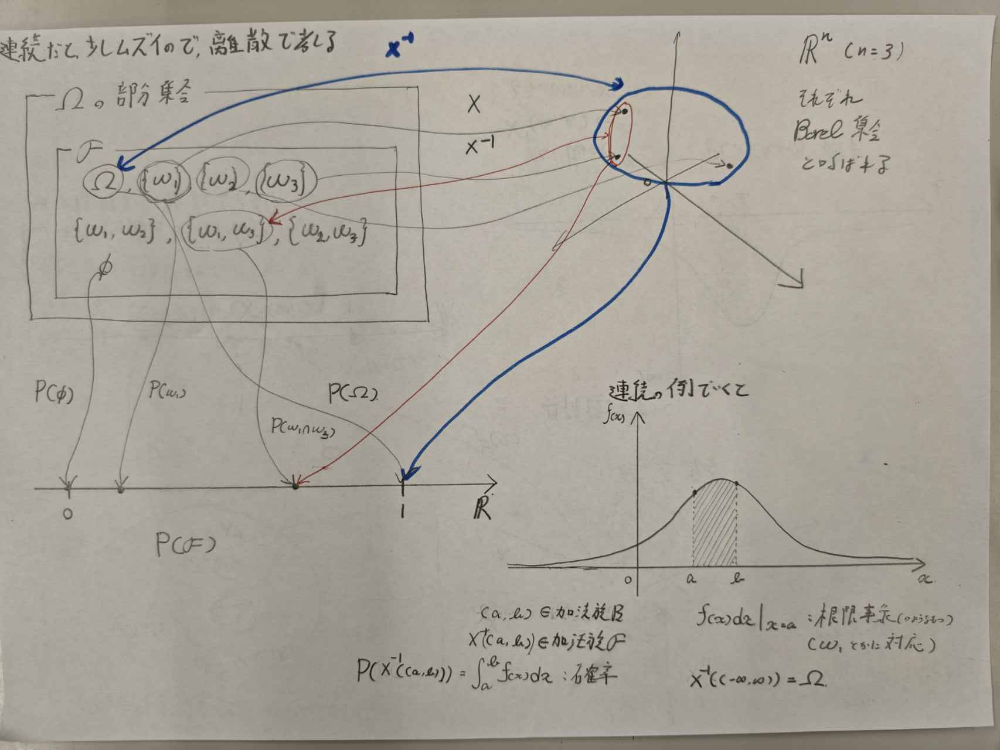

## はじめに
確率微分方程式です．応用が目標なのでそんなに厳密じゃないです．
あと初めて触れる分野なので，じっくりやっていきたいと思います．
あと教科書をパラパラ見てみた感じ，この確率論の概要が前提みたいな所がありそうなので，Ankiなどを活用して概念を覚えていきたい．

## $\sigma$-加法族と確率測度
確率とは，対象とする事象の起こりやすさを定量化したものである．通常事象というものを直感的に理解できるものとして無定義に取り扱うことが多いが，確率の定量化を数学的に議論するにはまず事象の定義を行わなければならない．

まず$\Omega$を生成点集合，すなわち試行を１回行うと，$\Omega$の点$\omega$が一つ選択されるような集合とする．$\Omega$は標本空間とも呼ばれる．$\Omega$の各「点」は標本と呼ばれるが，それは生起結果を表すもので，一般に数ではない．
（例えば，A,B,Cの内くじを引いて当てるとき，そのくじの結果Bが手に入ったとする．これは数ではない．）

我々が観測を行うと，$\Omega$の点のどれかが生起した結果が観測されるのだから，事象というものは$\Omega$の部分集合であると考えられるのが自然である．
だが，すべての部分集合が事象の資格を持っているとは限らない．
（例えば，サイコロを1回投げる試行において，出た目そのものは見えず偶数か奇数かだけを判定する状況を考える．このとき，偶数の目が出るという部分集合$\{ 2,4,6 \}$は結果を識別できるため事象として扱えるが，個別の$\{2\}$という部分集合は，この状況下では生起したかどうかを判別できないため，事象の資格を持たない）

また事象と呼ぶためにはどうしても満たさなければならない性質がある．
例えばある部分集合$A$が事象であれば，それが起こらない確率も計算できなければならない．すなわちその補集合$A^c$も事象でなければならない．
$A$と$B$ がともに事象であれば$A$または$B$が起こる確率，$A$かつ$B$の起こる確率も計算できなければならないので，その和集合や席集合も事象でなければならない．このように事象と呼んで良い部分集合の集まりには自然な制約が発生することになる．これを数学的にまとめたのが次の概念である．

### $\sigma$-加法族の定義

$\Omega$の部分集合の族(集合を要素に持つ集合)$\mathcal F$で
1. $\Omega \in \mathcal F$
2. $A \in \mathcal F  \Rightarrow A^c \in \mathcal F$
3. $A_1,A_2 ,... \in \mathcal F \Rightarrow \bigcup_{n = 1}^{\infty} A_n \in \mathcal F$
の3条件を満たすものを，$\sigma$-加法族と呼ぶ．

我々は，この$\sigma$-加法族$\mathcal F$の要素を事象と呼びたいのであるが，確率の概念を導入する前に事象だけを単独に定義するのは適切ではないため，(確率が満たすべき足し算のルールと関連付けながら，確率と事象を一対のものとして定義していく必要がある．)
引き続いて確率を定義することにしよう．
### 確率の定義
$\mathcal F$の各要素に対して実数を対応させる写像$P$が
1. $P(A) \ge 0$
2. $P(\Omega) =1$
3. $A_1, A_2 ,... \in \mathcal F, A_i \cap A_j = \phi   (i \neq j) \Rightarrow P\left( \bigcup_{n = 1}^{\infty} A_n \right) = \sum_{n = 1}^{\infty} P(A_n)$
を満たすとき，$P$を確率測度と呼び，$P(A)$を$A$が起こる確率と呼ぶ．

確率測度は集合に対して実数を対応させる写像であるために，集合関数と呼ばれることがある．

以上の定義に基づいて，$\mathcal F$の要素を事象と呼ぶ．数学的には$\mathcal F$の要素を可測集合と呼ぶことが多い．また$\Omega$と$\mathcal F$をペアで考えた$(\Omega, \mathcal F)$をその上に測度（確率測度）が定義できるという意味で可測空間と呼ぶ．
同じ$\Omega$でも観測の対象をどこまで細かく設定するかによって$\mathcal F$は異なるものとなり得る．

例えば，サイコロを一回振るという例を考える．標本空間は
$\Omega = \{1,2,3,4,5,6  \}$となる．この$\Omega$のすべての部分集合からなる集合族$\mathcal F$は$\sigma$-加法族であるが，
$\mathcal G = \{ \{ 1,3,5 \}, \{ 2,4,6 \} \}$もまた$\sigma$-加法族である．$(\Omega, \mathcal F), (\Omega , \mathcal G)$はそれぞれ可測空間であり，前者は振って出た目をすべて記録することを意味し，後者は偶数か奇数かだけを記録することを意味する．

さらに以上をまとめる形で次の用語を導入する．
$(\Omega, \mathcal F , P)$を確率空間と呼ぶ．
- $\Omega$ は，世界そのものの可能な状態
- $\mathcal F$は，その世界をどの細かさで観測できるか，情報
というイメージが適している．
確率を論じるにあたっては必ず確率空間を与えておく必要がある．

## ほとんど確実

さて，上述のように自然な要請として， $\sigma$-加法族に可算無限回のBool演算を許したわけだが，このことにより少しややこしい事象が顔を出してくることになる．確率の定義から，空集合$\phi$の確率測度は０になることは明らかであるが，逆は必ずしも成立しないため（標本空間が無限個の点を持つ場合，個々の点が選ばれる確率がすべて0になるから）次の概念の導入が必要となる．

### $P$零集合の定義 

$\mathcal F$の要素$N$で$P(N) = 0$となるものを$P$零集合とよぶ．

確率が０となる事象に属する点$\omega$は最初から除外しておけばよいという考えがでてくるが，無限集合になると除外するわけにはいかなくなる(個々の生起確率は０であるため，それらを除外すると標本空間が$\phi$となり意味がなくなるから)この結果，零事象の余事象として次の概念が必要となってくる．

### ほとんど確実（Almost Surely）の定義
ある事象$A$が生起する確率が１のときこれを$A(a.s.)$と表記し，Aはほとんど確実に起きるという．

実用的応用を考える上でも，$\Omega$が無限集合となる場合を取り扱えるようにしておかなければならないため，数学的な記述においては「ほとんど確実に」という用語が頻繁に登場するので，この用語の意味は理解しておく必要がある．

## 確率変数
標本空間$\Omega$は一般に数の空間であるとは限らないので，諸々の統計量を数量化するには不便と言うより，数量化そのものが不可能であることのほうがむしろ普通となっている．そこで，数量化が可能でしかも取り扱いに便利な空間に移して議論したほうが都合が良い．この写像を広い意味で**確率変数**とよぶ．
### 実確率変数
まず，標本空間を実数空間に写像することを考えよう．我々が実数空間において確率的量を計算するということは，基本的には積分計算を行うということであると言って良い．したがって実数空間における積分論に準拠して，議論を進めていかなければならない．こういった視点で言えば実数空間で計算対象の基本となるのは区間である．

与えられた区間に値をとる確率は当然計算できなければならないし，それらの和集合からなる集合でも確率が計算できなければ都合が悪い．すなわち，これらが先に述べた事象に対応するものであると言うことが要請される．そこで，**写像先の実数空間**において事象に対応する集合として次の定義を導入する．

### Borel集合の定義
1. $n$次元Euclid空間の開部分集合をすべて含む最小の$\sigma$-加法族を$\mathcal B (\mathbb R^n)$と書き，これをBorel加法族と呼ぶ
2. Borel加法族の部分集合をBorel集合と呼ぶ

開部分集合とは，境界がない部分集合のことである．
（離散の場合は，いったん置いておいてここでは連続空間の話をしているのだろう）
実用上考察の対象となる$\mathbb R^n$の部分集合はすべてBorel集合であると考えてしまって問題はない．
さて，我々はすべてのBorel集合に対して確率の計算が行えることを要請したいわけだが，確率の計算はあくまで元の確率の確率測度$P$によってしか行えないので，写像$X$によりBorel集合に写される要素の集合が，必ず可測集合でなければならない．つまり，標本空間$\Omega$からその写像は任意に選定できるということにならず，ある制約が加わることになる．

### 写像$X$の制約
写像$X : \Omega \rightarrow \mathbb R^n$が
$$
X^{-1}(B) = \{ \omega ; X(\omega) \in B\} \in \mathcal F (\forall B \in \mathcal B(\mathbb R^n))
$$
を満たす必要がある．このとき$X$を$\mathcal F$可測写像と呼ぶ．

この図を見れば分かるが，逆写像が$\mathcal F$に戻ってくることを要請している．

ここでこの写像は単に実確率変数と呼ばれる．
このように実確率変数の導入により標本空間$\Omega$が $\mathbb R^n$に写される．
なので可測空間が置き換えられたと考えて良い．

###  確率分布の定義
確率変数$X$について，
$$
P_X(B) = P(X^{-1}(B)) = P(\{ \omega ; X(\omega) \in B \}) , (B \in \mathcal B) 
$$
により定まる可測空間$(\mathbb R^n , \mathcal B^n)$上の確率測度$P_X$を確率変数$X$の確率分布とよぶ．
しばしば$P(X^{-1}(B))$は$P(X \in B)$と略記される．
一応確率分布関数と確率密度関数の定義も書いておく
$$
F_X(x) = P_X((-\infty , x]) =  P(X \le x)
$$
$$
f_X(x) = \frac{\partial^n}{\partial x_1 ... \partial x_n} F_X(x)
$$
## 一般の確率変数
実確率変数を導入することによって確率論的な記述が十分に可能になる例は多いが，確率過程に議論を拡張する場合，標本空間からの写像先を，実数空間から一般の空間に拡張しておく必要が生じる．
$S$を一般の空間として，実確率変数における写像$X : \Omega \rightarrow \mathbb R^n$を$X \rightarrow S$に拡張することを考える．
写像先である$S$を一般の空間に拡張する場合，Borel加法族に相当する部分集合族を考えなければ定義を拡張できない．
このため$S$は**位相空間**(距離に依存せず，開集合のルールを定めることで「近さ」や「つながり」を表現できるようにした空間)であるものとしBorel加法族，Borel集合を一般化して，次の定義を導入しよう．

### $S$値位相確率変数の定義
$S$を一般の位相空間とし，$S$の開部分集合族が定義されているものとする．
1. $S$の開部分集合族の要素をすべて含む最小の$\sigma$-加法族を$\mathcal B(S)$と表し，$S$の位相的Borel加法族とよび，その要素を位相的Borel集合とよぶ．
2. $$ X^{-1}(B) = \{ \omega ; X(\omega) \in B\} \in \mathcal F (\forall B \in \mathcal B(S))$$ を満たすとき，$X$を$S$値位相確率変数とよぶ．

$S$が位相空間であると仮定することは実用的な応用を考える上では特に問題のある制約ではないと言ってよい．

補足：この概念は[[学習/Zawa25721_documents/Published/StochasticDifferentialEquations/5|5]]で再登場する．