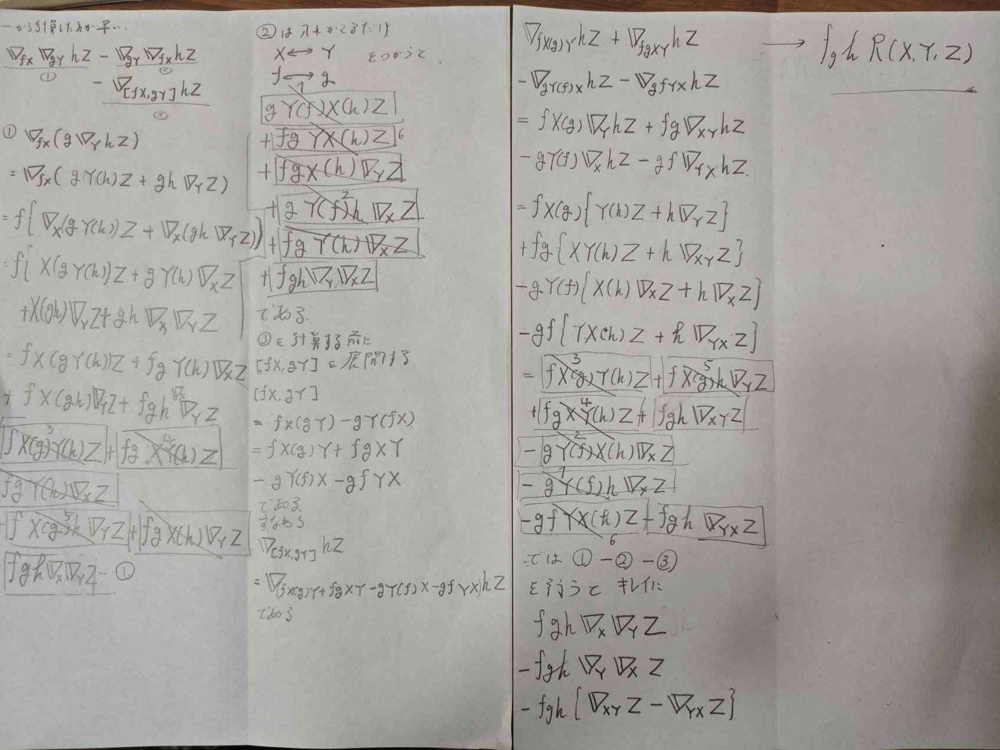

はじめにベクトル場の共変微分を公理的に定義し，そこから平行移動とは何かを調べてこうと思う．

## ベクトル場の共変微分

多様体$M$上の共変微分を次で定義する．

### 定義
以下の４条件を満たす写像
$$
\nabla : \mathcal X(M) \times \mathcal X(M) \to \mathcal X(M) : (X,Y) \mapsto \nabla_X Y
$$
を$M$の**共変微分**という，任意の$X,Y,Z \in \mathcal X(M)$と任意の$f \in C^{\infty} (M)$に対し
$$
\text{i}) \quad \nabla_X(Y + Z) =  \nabla_X Y + \nabla_X Z
$$
$$
\text{ii}) \quad \nabla_X(fY ) =  (Xf)Y + f \nabla_X Y
$$
$$
\text{iii}) \quad \nabla_{X+Y}(Z) =  \nabla_{X} Z + \nabla_Y Z
$$
$$
\text{iv}) \quad \nabla_{fX}(Y) = f \nabla_X Y 
$$
この性質を満たす写像はいくらでもあるのだが，そのうちのどれを共変微分として採用するかは各人の自由である，という一般的な立場を取ることにする．条件iiはLeibniz則であり，まさにこの要請のため
$$
F(X,Y) : = \nabla_X Y
$$
はテンソル性を満たさない．示してみよう．
まずテンソル性を満たすとは
$$
\text{i)} \quad F(fX , Y) = fF(X,Y)
$$
$$
\text{ii)} \quad F(X , fY) = fF(X,Y)
$$
を満たすことである．
i)に関しては，
$$
F(fX, Y) = \nabla_{fX}(Y) = f \nabla_X Y 
$$
を満たすので良い．だがii)に関しては
$$

\nabla_X(fY ) =  (Xf)Y + f \nabla_X Y  \ne fF(X, Y)

$$
なので成立しない．
つまり共変微分は$(1,2)$型テンソル場ではない．(前回参照)
だが，共変微分を２つ与えてそれの差をとる，これはテンソル性を満たすことが分かる．実際に計算しよう．

$$
S(X,Y) := \nabla_XY - \nabla'_XY 
$$
任意の$f,g \in C^{\infty}(M)$に対して
$$
\begin{align}
S(fX, gY) &= \nabla_{fX}(gY) - \nabla'_{fX} (gY) \\
		&= f \nabla_{X}(gY) -f\nabla'_X(gY) \\
		&= f \{ (Xg)Y + g\nabla_X Y \} -  f \{ (Xg)Y + g\nabla'_X Y \} \\
		&= fg S(X,Y)
\end{align}
$$
となるので，$S$は$(1,2)$型テンソル場である．このことからなにか標準的な共変微分$\nabla ^ {(0)}$を$M$上に固定したなら，$M$上の共変微分全体と$M$上の$(1,2)$型テンソル場とかが，1対1に対応することになる．
次に，共変微分の局所座標表示について考えてみる．座標近傍を一つ固定するとき
$$
\nabla_{\partial_i} \partial_j =: \Gamma^{k}_{ij} \partial_k 
$$
で定まる$n^3$個の$C^\infty$級関数の組$\{ \Gamma^k_{ij} \}$を局所座標系に関する接続係数と呼ぶ．２つの接続係数の変換式は(計算は面倒なので省略するが)
$$
\Gamma^k_{ij} = \frac{\partial \xi^a}{\partial x^i}  \frac{\partial \xi^b}{\partial x^j}  \frac{\partial x^k}{\partial \xi^c} \Gamma^c_{ab} + \frac{\partial^2 \xi^c}{\partial x^i \partial x^j} \frac{\partial x^k}{\partial \xi^c} 
$$
となる．
ここで共変微分がテンソル場ではないことはすでに述べているが，座標変換則を介してこの事実を確認していく．
一般に，座標変換$(x^i) \to (\xi^a)$に伴い，一次微分形式やベクトル場は
$$
dx^i = \frac{\partial x^i}{\partial \xi^a} d \xi^a , \qquad \frac{\partial}{\partial x^i} = \frac{\partial \xi^a}{\partial x^i} \frac{\partial }{\partial \xi^a} 
$$
と変換されるので，もし$F$が$(r,s)$型テンソルであったなら，テンソル性から
$$
F^{i_1 , ... ,i_r}_{j_1 , ... , j_s} = 

\left( \frac{\partial x^{i_1}}{\partial \xi^{a_1}} \right) \cdots
\left( \frac{\partial x^{i_r}}{\partial \xi^{a_r}} \right) 

\left( \frac{\partial \xi^{b_1}}{\partial x^{j_1}}  \right) \cdots
\left( \frac{\partial \xi^{b_s}}{\partial x^{j_s}}  \right)F^{a_1 , ... ,a_r}_{b_1 , ... , b_s}
$$
という座標変換則をみたすことになる．だが接続係数の座標変換はこれを満たさない(第二項が存在するためである)．
こうして共変微分がテンソル場でないという事実が，共変微分の成分表示のレベルでも確認できた．

## アファイン接続
### 定義
多様体$M$の各座標近傍に，座標変換則を満たす$C^\infty$級関数の組$\{ \Gamma^k_{ij} \}$を与えることを，$M$にアファイン接続を与えるという．

共変微分とアファイン接続は同一の概念である．
次に平行移動を定義したいのだが，Euclid平面のようにいきなり遠く離れた荷点での接ベクトルを対応付けるのではなく曲線に沿って少しづつ平行移動させるという方針を取る．離れた二点の間で接ベクトルを平行移動すると，一般にその結果はその二点を結ぶ経路に依存してしまうからである．

そこで，多様体$M$上に，平行移動の経路を与える滑らかな曲線$C = \{ p(t) \}$を任意に用意する．$M$ の座標近傍においてこの曲線を$p(t) = (x^1(t) , ... ,x^n(t))$と局所座標表示すると，点$t = t_0$における曲線$C$の速度ベクトル$\dot p(t_0)$は
$$
\frac{d}{dt} f(x^1 , ..., x^n) = \frac{dx^i}{dt} \frac{\partial f}{\partial x^i} \to \frac{dx^i}{dt}(t_0) \left(  \frac{\partial}{\partial x^i}  \right)_{(p(t_0))}
$$
で与えられる．
これを$\left( \frac{d}{dt} \right)_{t_0}$と表記することもある．さらに
$$
\frac{d}{dt}
$$
と書いた場合は，曲線$C$の速度ベクトルからなる曲線$C$に沿って定義されたベクトル場を表すものとする．

### 平行
#### 定義
多様体$M$にアファイン接続$\nabla$ が与えられているとする．$M$上の滑らかな曲線
$$
C = \{ p(t) ; a \le t \le b \}
$$
に沿って定義されたベクトル場$Z = \{ Z_{p(t)} \}$が，
$$
\nabla_{\dot p(t)} Z = 0
$$
を満たすとき，$Z$ は接続に関して$C$に沿って平行であるという．

このままだと意味がわからないので，局所座標表記をしてみる．
$$
Z_{\dot p(t)} = Z^i (t) \left(  \frac{\partial}{\partial x^i}  \right)_{p(t)}
$$
と成分表示すると
$$
\begin{align}
\nabla_{\frac{d}{dt}}Z &= \nabla_{\dot x \frac{\partial}{\partial x^i}} \left(  Z^j \frac{\partial}{\partial x^j}  \right) \\
&=\dot x^i \left(\frac{\partial Z^j}{\partial x^i} \frac{\partial}{\partial x^j} + Z^j \nabla_{\frac{\partial}{\partial x^i}}\frac{\partial}{\partial x^j}  \right) \\ 
&= \left( \dot Z^k + \dot x^i Z^j \Gamma^k_{ij} \right)
\frac{\partial}{\partial x^k}
\end{align}

 $$
 となるので，すべての$t$について
 $$
\dot Z^k + \dot x^i Z^j \Gamma^k_{ij}  = 0
$$
が成立することが同値である．

#### 測地線方程式

ここで$Z = \dot p$のとき
$$
\ddot x^k + \dot x^i \dot x^j \Gamma^k_{ij}  = 0
$$
となるが，これを満たすような曲線を測地線という．

### 平行移動
$M$上の滑らかな曲線$C$と$v \in T_{p(a)}M$が任意に与えられたとき，
$$
\dot Z^k + \dot x^i Z^j \Gamma^k_{ij}  = 0
$$
の解として求まるベクトル場$Z$ の$t = b$での値$Z_{p(b)} \in T_{p(b)}M$を$C$に沿って
$v$を$p(a)$から$p(b)$まで平行移動して得られる接ベクトルという．
平行移動は，２つの接空間$T_{p(a)}M$と$T_{p(b)}M$の間の対応関係
$$
\Pi_C : T_{p(a)}M \to T_{p(b)}M
$$
を定める．これを$C$に沿った接空間の平行移動という．
定理として，平行移動は全単射な線型写像というものがある．

これは上の方程式が線型方程式であることからの帰結である．

なお，上記定義では$C$を滑らかな曲線としていたが，区分的に滑らかな曲線に拡張するのは容易である．すなわち$C$の例外点$c_1 , c_2 , ..., c_k$とするときかく例外点で曲線を切り分け
$$
\Pi^a_b = \Pi^{c_k}_b \circ  \cdots \circ \Pi^{c_1}_{c_2} \circ \Pi^{a}_{c_1}
$$
を満たすように平行移動すれば良い．
こうしてアファイン接続が定義された多様体$M$上では，曲線$C$を介して，離れた2点$p(a), p(b)\in M$での接ベクトルが平行かどうかを論ずることが可能となった．つまり
$$
v \in T_{p(a)}M とw \in T_{p(b)}M がCを介して平行 \Leftrightarrow \Pi_C  v = w
$$
というわけでは
両者の実質的な違いは
$$
(\Pi_C v) - w
$$
で測れるという視点がある．これの無限小版を考えることにより，共変微分の幾何学的意味付けを与えることができる．

### 定理： 共変微分の幾何学的意味
$M$をアファイン接続が与えられた多様体とし，点$p(a) \in M$を通る$M$の滑らかな曲線
$$
C = \{ p(t) ; a-\epsilon < t< a + \epsilon \}
$$
を考える．任意のベクトル場$Y \in \mathcal X (M)$に対し
$$
(\nabla_{\dot p(t) }Y)_{p(a)} = \lim_{t \to a} \frac{1}{t-a} \{ \Pi^{p(t)}_{p(a)} 
Y_{p(t)} - Y_{p(a)}
\}
$$
が成立する．

これは曲線$C$における点$p(a)$の共変微分を意味している．証明はあるが省略する．意味は理解できるので．（これを定義にすればよいのにと思うが，そうしてしまったらどうやって平行移動を定義するのかという循環論法になるので，やはり共変微分の公理を先に定義してこの循環を止める手法が一般的であると思われる．）

## 曲率
### 定義
アファイン接続を持つ多様体上で定義された三重 $C^\infty(M)$-線型写像
$$
R : \mathcal X(M) \times \mathcal X(M) \times \mathcal X(M) \to \mathcal X(M)
$$
$$
R(X,Y,Z) = \nabla_X (\nabla_Y Z) - \nabla_Y(\nabla_X Z) - \nabla_{[X,Y]} Z 
$$
を接続のRiemann曲率テンソル場という．
括弧積が久しぶりに出てきたので，一応書いておくと
$$
[X,Y] = XY - YX
$$
である．
演習問題で，テンソル性を示せとかあるので，示してみよう．
$$
R(fX ,gY ,hZ) = fghR(X,Y,Z)
$$
であることを示したい．
まず素直に左辺を定義式に代入すると
$$
R(fX,gY,hZ) = \nabla_{fX} (\nabla_{gY} hZ) - \nabla_{gY}(\nabla_{fX} hZ) - \nabla_{[fX,gY]} hZ 
$$
写すのだるいので，計算用紙をそのまま載っけておく．

最後で一気に消えるのが心地よい．
なんにせよ，Riemann曲率がテンソル性を持つことがわかった．
次に局所座標におけるRiemann曲率の成分を計算する．
まあ$R(\partial_i , \partial_j,\partial_k)$を計算すれば良いだけなので，さっきの計算と比べたら楽である．
めんどいので省略するが
$$
R_{ijk}^l = \partial_i \Gamma^l_{jk} - \partial_j \Gamma^l_{ik} + \Gamma^m_{jk} \Gamma^l_{im} - \Gamma^m_{ik}\Gamma^l_{jm}
$$
である．見た目はなかなかゴツいが，慣れればそこまで難しくはない．

さてベクトルの平行移動は一般に始点と終点を結ぶ曲線の選び方に依存してしまい，それを定量的に表す量が曲率である．経路の違いによる平行移動の結果の違いが本当に曲率テンソルと関係するのか計算で確かめていく．
座標近傍において座標曲線$x^i$と$x^j$を辺に持ち，次の4点を頂点とする微小四辺形ABCDを考える．まず点Aの座標を$x = (x^1 , ... , x^n)$とする．変位ベクトルを$\delta_i = (0,0,...,\epsilon_i , 0,...,0)$で表し

点Bは$x + \delta_i$，点Dは$x + \delta_j$，点Cは$x + \delta_i + \delta_j$とする．点Cにおける接ベクトル$\partial _k$をB経由でAに持っていくのと，D経由で持っていったとき，接ベクトルがどれくらい異なるのかを調べる．

計算したい量は
$$
\Pi^{x + \delta_i}_x \Pi^{x + \delta_i + \delta_j}_{x + \delta_i} \partial_k(x + \delta_i + \delta_j) - \Pi^{x + \delta_j}_x \Pi^{x + \delta_i + \delta_j}_{x + \delta_j} \partial_k(x + \delta_i + \delta_j) 
$$
である．まあテイラー展開して整理すればこれは

$$
= \epsilon_i \epsilon_j R(\partial_i,\partial_j,\partial_k) + O(\epsilon^3)
$$
となることが分かる．なのでRiemann曲率とは微小四辺形の面積$\epsilon_i\epsilon_j$に比例する主要項を表していることが分かる．

ところで，上の式には3次以上の微小量が存在するのでRiemann曲率がゼロならば本当に平行移動が経路によらないのかどうか，この計算だけからでははっきりしない．そこで改めてこの事実を証明しておく．

必要十分条件の式は，

$$
\frac{\partial Z^l}{\partial x^i} + Z^m \Gamma^l_{im} = 0
$$
である．このようなベクトル場が局所的に存在するための必要十分条件は
$$
\frac{\partial^2 Z^l}{\partial x^i \partial x^j} = \frac{\partial^2 Z^l}{\partial x^j \partial x^i}
$$
である．（Schwarzの定理より）
よってこれは
$$
\frac{\partial}{\partial x^i} (Z^m \Gamma^l_{jm}) = \frac{\partial}{\partial x^j} (Z^m \Gamma^l_{im}) 
$$
である．こいつの計算を進めると
$$
Z^k R(\partial_i,\partial_j,\partial_k)= 0
$$
であることが分かる．
なのでRiemann曲率が0なら平行移動は始点と終点を結ぶ曲線のとり方に依存しないのである．

## 捩率
さっき話したRiemann曲率と対をなす重要な量が捩率である．
### 定義：捩率
アファイン接続$\nabla$を持つ多様体$M$上で定義された2重$C^{\infty}(M)$-線形写像
$$
T : \mathcal X(M) \times \mathcal X(M) \to \mathcal X(M)
$$
$$
(X,Y )\to \nabla_X Y - \nabla_Y X - [X,Y]
$$
を接続$\nabla$の捩率テンソルと呼ぶ．
テンソル性を示そう．
$$
\begin{align}
T(fX,gY) &=  \nabla_{fX} gY - \nabla_{gY} fX - [fX,gY] \\
&= f\nabla_X gY - g\nabla_Y fX -(fX(gY) - gY(fX)) \\
&= f(Xg + g\nabla_XY) - g(Yf + f\nabla_YX) - (fXg+fgXY - gYf -gfYX)\\
& =fg(\nabla_XY - \nabla_YX -[X,Y]) \\
& = fgT(X,Y)
\end{align}
$$
ということで成立する．
座標近傍での成分は，計算すると
$$
T^k_{ij} = \Gamma^k_{ij} - \Gamma^k_{ji}
$$
である．

捩率の幾何学的解釈を行う．

まず曲率と同様の条件で，次の量を考える．

$$
\{\epsilon_i \partial_i(x) + \epsilon_j \Pi^{x + \delta_i}
_x \partial_j(x + \delta_i)\}
-
\{\epsilon_j \partial_j(x) + \epsilon_i \Pi^{x + \delta_j}
_x \partial_i(x + \delta_j)\}

$$
第一項は
$$
A \to B \to D
$$
を表し，
第二項は
$$
A \to C \to D
$$
を表す．すなわちEuclid空間なら当然０になる（閉じたループになるので）．
これを計算すると
$$
\epsilon_i\epsilon_j T(\partial_i,\partial_j) + O(\epsilon^3)
$$
となり，このズレを表す量であることが分かる．

## 平坦
多様体が平坦であるというということの定義には，いくつかの流儀があるが，ここでは次の定義を用いることにする．

### 定義：平坦
アファイン接続$\nabla$をもつ多様体$M$において，Riemann曲率と捩率テンソル場が共に恒等的にゼロとなるとき，$M$は$\nabla$-平坦であるという．

Euclid空間やトーラスは平坦である．

平行性と強い関連をもつ概念としてアファイン座標系というものがある．

## 定義：アファイン座標系
アファイン接続$\nabla$を持つ多様体$M$の座標近傍$(U;x^1,...,x^n)$において，接続係数$\{ \Gamma^k_{ij} \}$が全て恒等的にゼロになるとき$(U;x^1 ,...,x^n)$を$\nabla$-アファイン座標近傍といい，局所座標系$(x^i)$を$\nabla$-アファイン座標系という．

注意するべきことは，平坦とは局所座標のとりかたによって変わることのない性質であるが．接続係数が恒等的に0になるという性質は座標系のとり方に依存する性質であることである，

定理として次が成立する．

アファイン接続$\nabla$を持つ多様体$\nabla$を持つ多様体$M$において，次の２条件は同値である．

i) $M$は$\nabla$-平坦である．
ii)$M$の各点周りに$\nabla$-アファイン座標近傍が存在する．

少し曖昧なので厳密に書く
$$

M \text{ が } \nabla\text{-平坦}
\iff
\forall p\in M,\ 
\exists (U_p;x^1,\dots,x^n)
\text{ such that }
p\in U_p
\text{ and }
\forall q\in U_p,\ \forall i,j,k,\ 
\Gamma^k_{ij}(q)=0.

$$
A such that B : Bを満たすようなA

そして次の定理は重要である．

### 定理：アファイン座標系の自由度
多様体$M$に座標近傍$(U;x^i)$と$(V;\xi ^a)$があって，$(x^i)$は局所$\nabla$- アファイン座標系だったとする．このとき$U \cap V$ において$(\xi^a)$も局所$\nabla$-アファイン座標系となるための必要十分条件は，座標変換$(x^i) \to (\xi^a)$がアファイン変換で書けることすなわち正則な行列$A$とベクトル$b$が存在して
$$
\xi = Ax + b
$$
となることである．

まあ，Euclid空間でいうところの回転座標のことだわな．

## Riemann接続

多様体$M$の(0,2) 型テンソル場$g$であって，各点$p \in M$で$g_p$が$T_pM$の内積となっているものをRiemann計量といい，Riemann計量$g$が与えられた多様体$M$をRiemann多様体といった．

### 定義：Riemann接続（Levi-Civita接続）

Riemann多様体$(M.g)$の各座標近傍$(U ; x^1 ,...,x^n)$において，
$$
\Gamma_{ij,k} := \Gamma^l_{ij}g_{lk} := \frac{1}{2} (\partial_i g_{jk} + \partial_k g_{ki} - \partial_k g_{ij})
$$
で定まる$M$のアファイン接続をRiemann接続またはLevi-Civita接続という．

ここで関係式$\Gamma_{ij,k} = \Gamma ^l_{ij} g_{lk}$は，$g(\nabla_{\partial _i} \partial _j, \partial _k)$の計算結果である．

また$g$は正定値なので
$$
g_{ij}g^{jk} = \delta^k_i
$$
が成立する．

さてRiemann計量には次の著しい性質を持つ

### 定理：平行移動に関する内積の不変性

$$
g_{p(b)} (\Pi_b^av, \Pi_b^a, w) = g_{p(a)} (v,w)
$$
すなわち，$v$と$w$の内積はLevi-Civita平行移動しても不変である．

一般に，アファイン接続$\nabla$を持つRiemann多様体$(M,g)$において，上の定理の性質を満たす時，
接続$\nabla$は計量的であるという．

次の定理も成立する．

### 定理：Riemann接続の特徴づけ

Riemann多様体$(M,g)$のアファイン接続$\nabla$がRiemann接続であるための必要十分条件は，$\nabla$が計量的であって，かつ捩率が0となることである．

## 部分多様体

部分多様体とはまあ多様体の部分なのだが，数学的な話はあとで書くとしてなぜこんな概念が情報幾何において必要なのかを考える．案外シンプルな理由で，統計モデルの中で実際に興味をもつモデル族が，しばしば低次元の制約付きモデルとして現れるからである．

例えば
$$
M = \{p(x;\theta)|\theta \in \Theta\}
$$
として，$f(\theta) = 0$のような制約したモデルを考えることが多い，すると
$$
S = \{ p(x;\theta) \in M | f(\theta) = 0\}
$$
は$M$の部分多様体になる．すなわち制約を考えるときに部分多様体が必要になってくるということだな．

### 定義：部分多様体

自然数$m,n$は$m < n$を満たしているとする．$n$次元多様体$N$の部分集合$M$が$N$の$m$次元部分多様体であるとは，$M$の任意の点$p$の周りに，$N$のある座標近傍$(U;x^1, ...,x^n)$がとれて，$M \cap U$ では
$x^{m+1}=\cdots = x^n = 0$になることである．

具体例を考える．2次元Euclid空間$N$は
$$
N = \{(x,y)| x,y \in \mathbb R\}
$$
であるが，これで$y = 0$という制約をおくと，部分多様体$M$は1次元であり
$$
M =\{x | x \in \mathbb R\}
$$
となる，実際
$$
N \cap U = \{(x,y) | x\in \mathbb R ,y =0\} 
$$
なので確かに部分多様体になっていることがわかる．

$N$での接続と$M$での接続を考える．$N$での接ベクトルが$M$での接ベクトルになるとは限らないのである．では一体どうすればよいのだろうか．
一つの考えとして各点$p\in M$において射影$\pi : T_pN \to T_pM$を適当に定め，これを用いて
$$
(\tilde \nabla_X Y)_p := \pi((\nabla_X Y)_p)
$$
という具合に定義することは可能である．色々な考えはあるだろうが，外側の多様体$N$がRiemann多様体の場合には，計量$g$を介して射影するのが標準的である．

$$

\tilde g (\tilde \nabla_X Y, Z) := g(\nabla_X Y,Z) \quad(\forall Z \in \mathcal X(M))

$$
で接続を定義する．これは接ベクトルを射影をしているのである．

具体例で考える
$$
N = \mathbb R^2
$$
で，$M$を単位円
$$
M = \{ (x,y)\in \mathbb R^2 | x^2 + y^2 = 1 \}
$$
とする．円のパラメータ表示は
$$
\gamma(\theta) = (\cos \theta,\sin \theta)
$$
とする．
円の単位接ベクトルは
$$
e(\theta) = \frac{d \gamma}{d \theta} = (- \sin \theta,\cos \theta)
$$
である．単位法線ベクトルは
$$
n(\theta) = (\cos \theta, \sin \theta)
$$
である．すると接空間は
$$
T_{\gamma(\theta)} M = \text{span} \{e(\theta)\}
$$
(spanは線型結合の意味)
であり，$n(\theta)$は$M$にたいして垂直である．ここで$\nabla_XY$を計算するわけだが，$X = e$，$Y = e$
として計算すると
$$
\nabla_e e = \frac{d e}{d \theta } = -n(\theta)
$$
になることがわかる．もともと$e \in TM$であったにも関わらず，$\nabla_e e = -n$なので$\nabla _e e  \notin TM$である．なので$N$の接続を$M$の接続そのままにはできない． そこで射影をする．接続が法線方向なので，接線成分は0となる，よって
$$
\tilde \nabla_e e = 0
$$
である．これを定義に沿ってやってみる．まず$M$における任意の接ベクトルは
$$
Z = ae
$$
である．すると
$$
g(-n,ae) =0
$$
であることがわかる．ここで
$$
\tilde g(\tilde \nabla _e e, ae) = 0
$$
でないといけないが，これは$\tilde \nabla_e e = 0$を意味している．

さて，もし任意の$X,Y \in \mathcal X(M)$に対して$\nabla _X Y$も$M$のベクトル場になっていたとしたら，それは$M$の接続構造が$N$から自然に誘導できることを意味している．そこでこのような良い性質を持つ部分多様体に名前を付けておこう

### 定義：自己平行部分多様体

$N$をアファイン接続$\nabla$を持つ多様体，$M$を$N$の部分多様体とする．任意の$p \in M$と$X,Y \in \mathcal X(M)$に対して
$$
(\nabla_X Y)_p \in T_pM
$$
となるとき，$M$は接続$\nabla$に関する$N$の自己平行部分多様体であるという．

ついでながら，これと関連の深い次の概念も導入しておこう．

## 定義：全測地的部分多様体

$N$をアファイン接続を持つ多様体，$M$を $N$の部分多様体とする．任意の点$p \in M$および$p(0) = p$かつ$\dot p(0) \in T_pM$を満たす$N$の任意の$\nabla$-測地線$p(t)$が十分小さなすべての$t$に対して$p(t) \in M$となるとき，$M$は接続に関する$N$の全測地的部分多様体であるという．

要するに，$p \in M$を通り，$p$で$M$に接する$N$の測地線が，いつまでも$M$の中にとどまっているということである．

ちなみに例は地球と赤道である．赤道以外なら大圏航路などがある．

それぞれの関係は
- $M$が自己平行なら，$M$は全測地的
- $N$の捩率がゼロかつ$M$が全測地的なら$M$は自己平行

である．

あと$N$の$m$次元多様体が自己平行となる必要十分条件は

$$
\begin{bmatrix}
x^1 \\
x^2 \\
\cdots \\
x^m \\
x^{m+1}\\
\cdots \\ 
x^n
\end{bmatrix} = 
A 
\begin{bmatrix}
\xi^1 \\
\xi^2 \\
\cdots \\
\xi^m \\
\end{bmatrix}
+b
$$
を満たす$A,b$が存在することである．

次回から双対アファイン接続に入る．